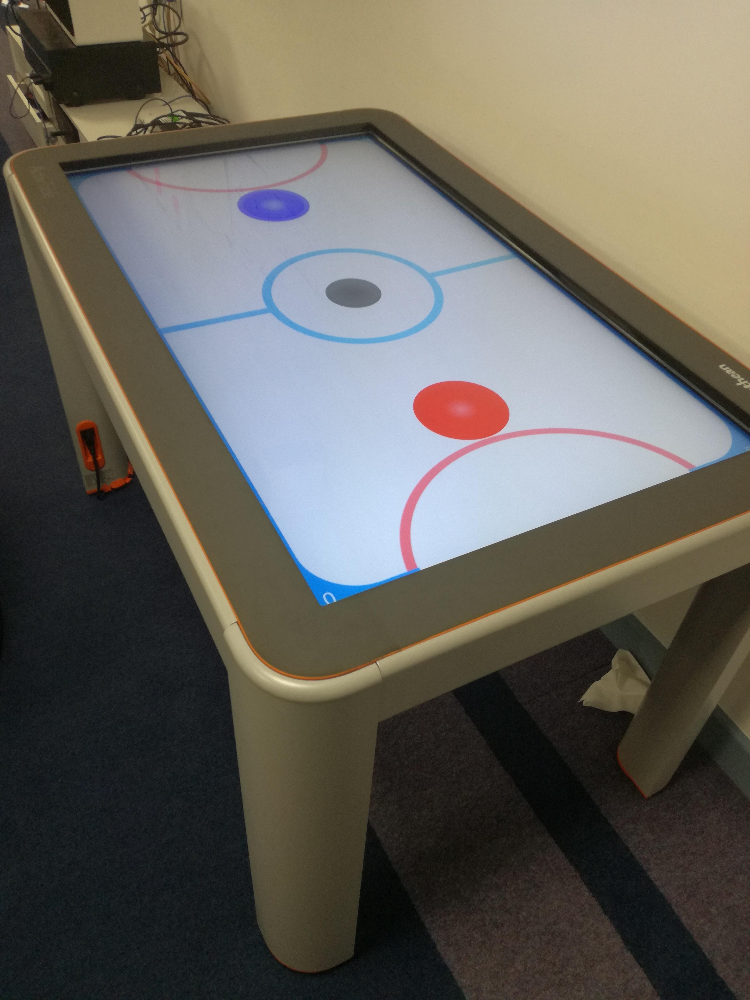

# Air Hockey for ActivTable

I created this project upon being asked to showcase some software to school students visiting Graham & Brown.
There was an ActivTable in the corner, not being used so I decided the idea was to simulate an air hockey game on our ActivTable (made by Promethean Ltd, Blackburn),
demonstrating what's possible with some free software available at home. This idea could translate on to a tablet or mobile.
The ActivTable is a large interactive touch screen PC, running windows 32 bit.
The engine used to make the game was Unity.

Photo of game running on an ActivTable

